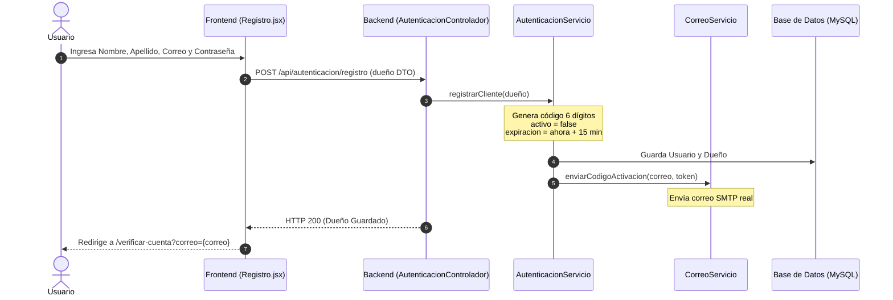
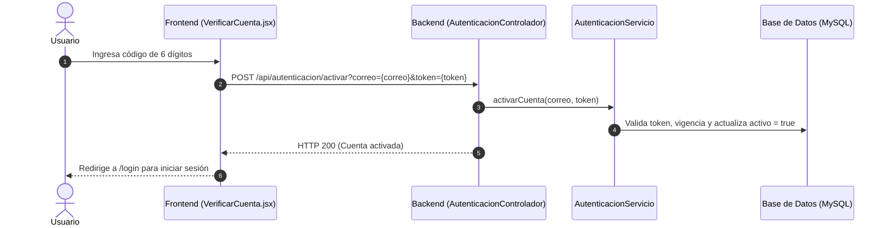
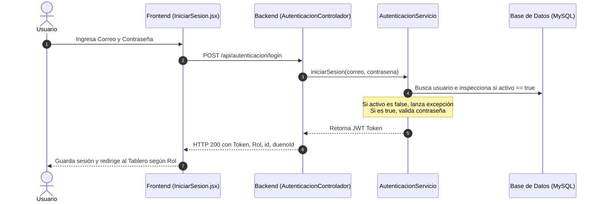
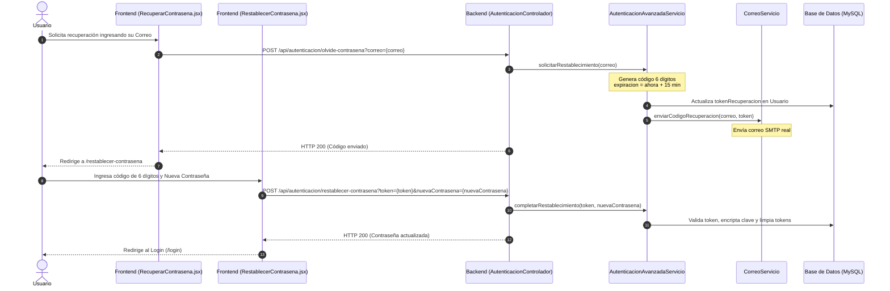

# Documentación Técnica: Flujos de Autenticación - Huesitos

Esta documentación describe la arquitectura y los flujos de control para el **Registro**, **Verificación/Activación de Cuenta**, **Inicio de Sesión (Login)** y **Recuperación de Contraseña** de la aplicación **Veterinaria Huesitos**.

---

## 1. Arquitectura General y Modelo de Datos

El sistema de autenticación se basa en **Spring Boot (Spring Security + JWT)** en el backend y **React (React Router + Tailwind CSS)** en el frontend.

### Entidades Afectadas
*   **[Usuario.java](../huesitos-backend/src/main/java/huesitos_backend/entidades/Usuario.java)**:
    *   `nombre` y `apellido`: Datos del usuario registrados en la base de datos (se omiten del Dueño inicialmente).
    *   `activo` (booleano): Indica si la cuenta ha sido verificada. Las cuentas recién creadas inician en `false`.
    *   `tokenRecuperacion` (String): Almacena el código numérico temporal de 6 dígitos para activación o recuperación de contraseñas.
    *   `expiracionToken` (LocalDateTime): Fecha límite de validez del código (15 minutos desde su generación).
*   **[Dueño.java](../huesitos-backend/src/main/java/huesitos_backend/entidades/Dueño.java)**:
    *   `nombreCompleto`: Concatenación de nombre y apellido del usuario.
    *   `telefono` y `direccion`: Registrados como opcionales (`nullable = true`) para permitir el registro simplificado, completándose posteriormente en la sección de Perfil.

---

## 2. Descripción Detallada de los Flujos

### Flujo A: Registro de Cuenta y Activación

El usuario se registra ingresando datos mínimos. Su cuenta se crea inactiva y se le envía un código de 6 dígitos por correo electrónico.





#### Reenvío de código:
*   Si el temporizador expira o no le llega el correo, el usuario puede presionar **"Solicitar un nuevo código"** en [VerificarCuenta.jsx](../huesitos-frontend/src/paginas/VerificarCuenta.jsx).
*   Se envía una petición a `POST /api/autenticacion/reenviar-codigo?correo={correo}`.
*   El backend regenera el token, actualiza la fecha de expiración y reenvía el correo.

---

### Flujo B: Inicio de Sesión (Login)

El inicio de sesión valida las credenciales y verifica que la cuenta esté activa.



---

### Flujo C: Recuperación de Contraseña

Permite a un usuario restablecer su contraseña olvidada mediante un código enviado a su correo electrónico.



---

## 3. Detalle de Endpoints (Controladores)

Los endpoints de autenticación están definidos en [AutenticacionControlador.java](../huesitos-backend/src/main/java/huesitos_backend/controladores/AutenticacionControlador.java):

| Método | Endpoint | Acceso | Parámetros / Cuerpo | Descripción |
| :--- | :--- | :--- | :--- | :--- |
| **POST** | `/api/autenticacion/registro` | Público | `@RequestBody Dueño` | Registra una cuenta inactiva de tipo cliente y envía código por correo. |
| **POST** | `/api/autenticacion/activar` | Público | `correo` (String), `token` (String) | Valida el token y activa la cuenta. |
| **POST** | `/api/autenticacion/reenviar-codigo` | Público | `correo` (String) | Regenera y reenvía el código de activación. |
| **POST** | `/api/autenticacion/login` | Público | `@RequestBody Usuario` (correo, contrasena) | Inicia sesión y retorna el token JWT. |
| **POST** | `/api/autenticacion/olvide-contrasena` | Público | `correo` (String) | Genera y envía por correo el código para restablecer clave. |
| **POST** | `/api/autenticacion/restablecer-contrasena` | Público | `token` (String), `nuevaContrasena` (String) | Valida código y actualiza la contraseña. |

---

## 4. Configuración de Seguridad (Spring Security)

Los endpoints anteriores están configurados como **públicos** en el filtro de seguridad de [SeguridadConfig.java](../huesitos-backend/src/main/java/huesitos_backend/config/SeguridadConfig.java):

```java
.requestMatchers(
    "/api/autenticacion/login", 
    "/api/autenticacion/registro",
    "/api/autenticacion/olvide-contrasena",
    "/api/autenticacion/restablecer-contrasena",
    "/api/autenticacion/activar",
    "/api/autenticacion/reenviar-codigo"
).permitAll()
```

Cualquier otra petición al API (salvo listado de servicios públicos) requerirá la cabecera `Authorization: Bearer <Token_JWT>`.

---

## 5. Resumen de Vistas del Frontend

1.  **[Registro.jsx](../huesitos-frontend/src/paginas/Registro.jsx)**: Solicita únicamente Nombre, Apellido, Correo y Contraseña. Envía un JSON con valores de teléfono y dirección nulos por defecto.
2.  **[VerificarCuenta.jsx](../huesitos-frontend/src/paginas/VerificarCuenta.jsx)**: Formulario de 6 casilleros con autoenfoque al escribir, soporte para pegar códigos enteros y temporizador visual de 15 minutos en tiempo real.
3.  **[IniciarSesion.jsx](../huesitos-frontend/src/paginas/IniciarSesion.jsx)**: Formulario convencional de email y contraseña. Muestra mensaje si la cuenta no ha sido activada aún.
4.  **[RecuperarContrasena.jsx](../huesitos-frontend/src/paginas/RecuperarContrasena.jsx)**: Solicita el correo electrónico para iniciar el proceso de recuperación de contraseña.
5.  **[RestablecerContrasena.jsx](../huesitos-frontend/src/paginas/RestablecerContrasena.jsx)**: Recibe el código de 6 dígitos ingresado por el usuario y los dos campos de contraseña nueva para reescribir las credenciales.
