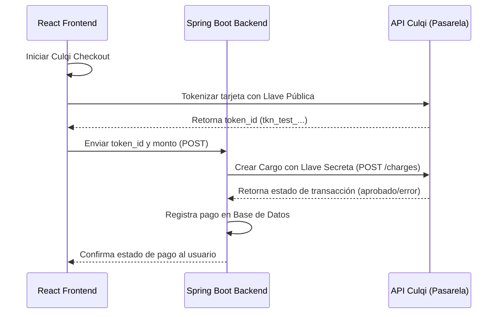

# Guía de Integración y Configuración de Culqi

Esta guía detalla los conceptos y pasos para integrar la pasarela de pagos **Culqi** en un proyecto monolítico o desacoplado con **React 18** en el frontend y **Spring Boot** en el backend.

---

## 1. Concepto y Flujo de Integración

A diferencia de Mercado Pago Checkout Pro (que redirecciona al portal de Mercado Pago), Culqi Checkout carga un modal (iframe seguro) directamente en tu sitio web.

El flujo de pago consiste en dos fases:
1. **Fase Frontend (Tokenización):** El cliente ingresa los datos de su tarjeta en el modal de Culqi. Culqi valida la tarjeta y responde con un **Token de Tarjeta** (ej. `tkn_test_abcd1234`).
2. **Fase Backend (Cargo):** Tu aplicación de React envía el token a tu backend de Spring Boot, el cual realiza la petición de **Cargo** final contra la API segura de Culqi utilizando tu **llave secreta (Secret Key)**.



---

## 2. Configuración de Credenciales

Culqi cuenta con dos tipos de llaves por cuenta (Sandbox y Producción):
* **Llave Pública (Public Key):** Prefijo `pk_test_` o `pk_live_`. Se usa únicamente en el Frontend (React).
* **Llave Secreta (Secret Key):** Prefijo `sk_test_` o `sk_live_`. Se usa únicamente en el Backend (Spring Boot). **Nunca la expongas en el frontend.**

---

## 3. Implementación en el Frontend (React)

### Paso 1: Cargar el script de Culqi
Agrega el script oficial en el archivo `index.html` de tu frontend:
```html
<script src="https://checkout.culqi.com/js/v4"></script>
```

### Paso 2: Crear el manejador y listener del Token
Configura el objeto `window.culqi` que llamará Culqi de forma asíncrona una vez tokenizada la tarjeta, y expón un disparador:

```javascript
import axios from 'axios';

// Configurar la llave pública
window.Culqi.publicKey = 'pk_test_TU_LLAVE_PUBLICA_AQUI';

export const inicializarYMostrarCulqi = (montoSoles, emailCliente, transaccionId) => {
  // Culqi requiere el monto en céntimos (ej: S/ 80.00 -> 8000 céntimos)
  const montoCentimos = Math.round(parseFloat(montoSoles) * 100);

  window.Culqi.settings({
    title: 'Clínica Veterinaria Huesitos',
    currency: 'PEN',
    amount: montoCentimos,
  });

  // Listener para capturar el token generado por Culqi
  window.culqi = async () => {
    if (window.Culqi.token) {
      const tokenId = window.Culqi.token.id;
      
      try {
        // Enviar token al backend para realizar el cargo
        const response = await axios.post('http://localhost:8080/api/pagos/culqi/cargo', {
          tokenId: tokenId,
          transaccionId: transaccionId,
          monto: montoSoles,
          email: emailCliente
        }, {
          headers: {
            Authorization: `Bearer ${localStorage.getItem('token')}`
          }
        });

        if (response.data.estado === 'APROBADO') {
          alert('¡Pago procesado con éxito!');
          window.location.reload();
        } else {
          alert('Pago rechazado: ' + response.data.mensaje);
        }
      } catch (error) {
        console.error('Error al procesar el cargo en el servidor:', error);
        alert('Hubo un error de conexión al procesar el pago.');
      }
    } else {
      console.error('Error de tokenización:', window.Culqi.error);
      alert(window.Culqi.error.user_message);
    }
  };

  // Abrir el modal del checkout
  window.Culqi.open();
};
```

---

## 4. Implementación en el Backend (Spring Boot)

### Paso 1: Configurar la Llave Secreta en `application.properties`
```properties
culqi.secret-key=sk_test_TU_LLAVE_SECRETA_AQUI
```

### Paso 2: Crear DTOs para la petición
```java
public record SolicitudCargoCulqi(
    String tokenId,
    Long transaccionId,
    BigDecimal monto,
    String email
) {}
```

### Paso 3: Crear el Controlador y Servicio de Cargos
Utiliza `RestTemplate` o `WebClient` para enviar la petición a la API de Culqi:

```java
@RestController
@RequestMapping("/api/pagos/culqi")
@RequiredArgsConstructor
public class CulqiControlador {

    @Value("${culqi.secret-key}")
    private String secretKey;

    private final RestTemplate restTemplate = new RestTemplate();
    private final TransaccionServicio transaccionServicio;

    @PostMapping("/cargo")
    public ResponseEntity<?> procesarCargo(@RequestBody SolicitudCargoCulqi solicitud) {
        try {
            // URL de Culqi API
            String url = "https://api.culqi.com/v2/charges";

            // Headers con la llave secreta
            HttpHeaders headers = new HttpHeaders();
            headers.setContentType(MediaType.APPLICATION_JSON);
            headers.set("Authorization", "Bearer " + secretKey);

            // Culqi requiere el monto en céntimos (entero)
            int montoCentimos = solicitud.monto().multiply(new BigDecimal("100")).intValue();

            // Cuerpo del Request para Culqi
            Map<String, Object> body = new HashMap<>();
            body.put("amount", montoCentimos);
            body.put("currency_code", "PEN");
            body.put("email", solicitud.email());
            body.put("source_id", solicitud.tokenId());

            HttpEntity<Map<String, Object>> entity = new HttpEntity<>(body, headers);

            // Ejecutar POST a Culqi
            ResponseEntity<Map> response = restTemplate.postForEntity(url, entity, Map.class);

            if (response.getStatusCode().is2xxSuccessful() && response.getBody() != null) {
                Map<?, ?> responseBody = response.getBody();
                String outcomeType = (String) ((Map<?, ?>) responseBody.get("outcome")).get("type");

                if ("venta_exitosa".equals(outcomeType)) {
                    String idCargo = (String) responseBody.get("id");
                    String referencia = "CULQI_" + idCargo;

                    // Actualizar estado en la base de datos
                    transaccionServicio.registrarPagoExitosoPasarela(
                            solicitud.transaccionId(),
                            idCargo,
                            referencia
                    );

                    Map<String, String> resExito = new HashMap<>();
                    resExito.put("estado", "APROBADO");
                    return ResponseEntity.ok(resExito);
                }
            }

            throw new RuntimeException("No se completó la venta exitosa en Culqi");

        } catch (Exception e) {
            Map<String, String> resError = new HashMap<>();
            resError.put("estado", "RECHAZADO");
            resError.put("mensaje", e.getMessage());
            return ResponseEntity.badRequest().body(resError);
        }
    }
}
```

---

## 5. Tarjetas de Prueba (Sandbox) para Simulación

Puedes probar con los siguientes datos simulados utilizando tu llave pública de pruebas (`pk_test_...`):

| Marca de Tarjeta | Número de Tarjeta | Fecha Vencimiento | CVV |
| :--- | :--- | :--- | :--- |
| **Visa** | `4111 1111 1111 1111` | Cualquier fecha futura | `123` |
| **Mastercard** | `5123 4567 8901 2345` | Cualquier fecha futura | `123` |
| **Amex** | `3782 822463 10005` | Cualquier fecha futura | `1234` |
| **Diners** | `3058 2938 4928 34` | Cualquier fecha futura | `123` |
