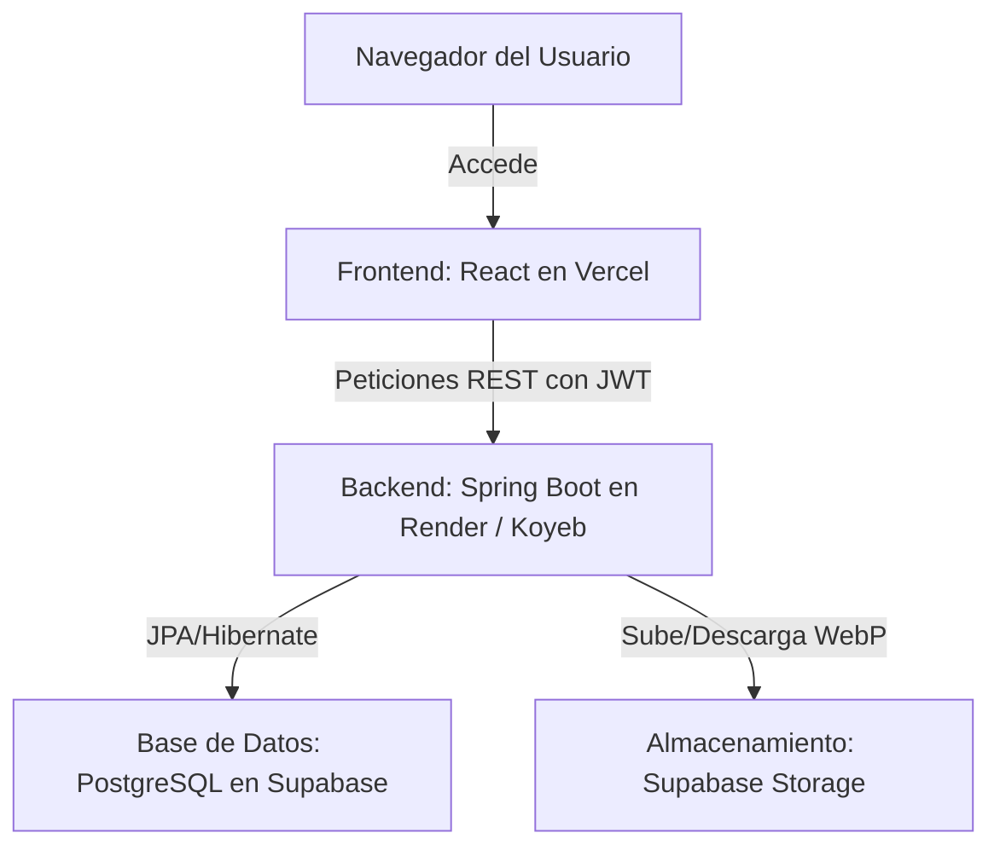

# Guía de Despliegue en Producción (Capa Gratuita) - Huesitos

Esta guía documenta la arquitectura de despliegue recomendada para presentar el proyecto utilizando servicios en la nube con planes gratuitos.

---

## 🗺️ Arquitectura de Despliegue



---

## 1. Base de Datos: Supabase (PostgreSQL)

Supabase ofrece una base de datos PostgreSQL gratuita ideal para la presentación.

### Migración de MySQL a PostgreSQL
Dado que el proyecto utiliza Spring Data JPA, la migración de la base de datos es muy simple:

1. **Dependencia Maven (`pom.xml`)**:
   Reemplazar el driver de MySQL por el de PostgreSQL:
   ```xml
   <!-- Reemplazar mysql-connector-j por: -->
   <dependency>
       <groupId>org.postgresql</groupId>
       <artifactId>postgresql</artifactId>
       <scope>runtime</scope>
   </dependency>
   ```

2. **Configuración de Spring (`application.properties`)**:
   ```properties
   spring.datasource.url=jdbc:postgresql://<HOST-DE-SUPABASE>:5432/postgres
   spring.datasource.username=postgres
   spring.datasource.password=<TU-CONTRASEÑA>
   spring.jpa.database-platform=org.hibernate.dialect.PostgreSQLDialect
   spring.jpa.hibernate.ddl-auto=update
   ```

---

## 2. Almacenamiento de Imágenes: Supabase Storage

Para evitar perder imágenes cuando el servidor backend se reinicie o suspenda (comportamiento típico de plataformas gratuitas como Render), se debe configurar el almacenamiento de objetos:

1. **Creación del Bucket**:
   * Crear un bucket público llamado `mascotas-perfiles` en la sección de Storage en Supabase.
2. **Integración en Spring Boot**:
   * Configurar el SDK de Supabase o usar su API REST en `StorageService.java` para subir los archivos `.webp` directamente y guardar únicamente la URL pública resultante en la base de datos MySQL/PostgreSQL.

---

## 3. Backend: Render o Koyeb (Spring Boot)

* **¿Por qué no Vercel?** Vercel es una plataforma serverless orientada a Node.js/frontend. Spring Boot requiere un servidor en ejecución continua o un contenedor que soporte Java.
* **Plataformas recomendadas**:
  * **Render (Plan Web Service Free)**: Despliega directamente desde GitHub mediante un archivo `Dockerfile` o detección automática de Java.
    * *Nota*: Si la aplicación no recibe tráfico durante 15 minutos, entra en modo suspensión. La primera petición tardará ~50 segundos en responder mientras "despierta" el servidor.
  * **Koyeb**: Excelente alternativa rápida con menor tiempo de inicio en su capa gratuita.

---

## 4. Frontend: Vercel (React + Vite)

El frontend se puede desplegar al 100% de forma gratuita en Vercel.

1. **Configuración de Variables de Entorno**:
   * Crear un archivo `.env.production` en el frontend y configurar la URL base que apunte al backend desplegado en Render/Koyeb:
     ```env
     VITE_API_URL=https://huesitos-backend.onrender.com
     ```
2. **Despliegue**:
   * Conectar el repositorio de GitHub a Vercel.
   * Vercel detectará que es un proyecto de Vite y configurará los comandos de construcción automáticamente (`npm run build`).
